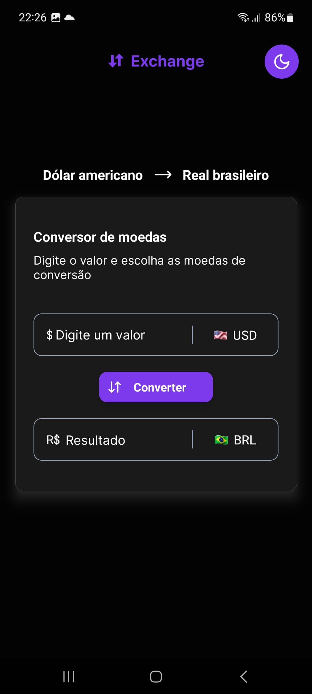

# 💰 Currency Converter

<p align="center">
  
  
</p>

## 📌 Sobre o Projeto

O **Currency Converter** é um aplicativo mobile desenvolvido em **React Native** que permite converter moedas de diversos países do mundo. Ele conta com um design moderno e suporta os temas **claro e escuro**, utilizando **NativeWind** para estilização. Além disso, ele utiliza a **Awesome API** para obter taxas de câmbio em tempo real.

## 🚀 Tecnologias Utilizadas

O projeto foi desenvolvido com as seguintes tecnologias:

- [React Native](https://reactnative.dev/)
- [Expo](https://docs.expo.dev/)
- [TypeScript](https://www.typescriptlang.org/)
- [NativeWind](https://www.nativewind.dev/)
- [Awesome API](https://awesomeapi.com.br/)

## 🔧 Requisitos

Antes de iniciar o projeto, certifique-se de ter instalado:

- [Node.js](https://nodejs.org/)
- [Expo CLI](https://docs.expo.dev/get-started/installation/)

---

## 📦 Como Executar o Projeto

### 1️⃣ Clonando o Repositório
```bash
$ git clone git@github.com:c4mpos-dev/currency-converter.git
$ cd currency-converter
```

### 2️⃣ Instalando Dependências
```bash
$ npm install
```

### 3️⃣ Executando o Aplicativo
```bash
$ npx expo start
```

Um QR Code será exibido no terminal. Utilize o aplicativo **Expo Go** para escanear e rodar o projeto no seu dispositivo.

---

## 📂 Estrutura do Projeto

```bash
currency-converter/
├── src/
│   ├── components/        # Componentes reutilizáveis
│   ├── screens/           # Telas do aplicativo
│   └── assets/            # Imagens e ícones
├── App.tsx                # Ponto de entrada do aplicativo
├── package.json           # Dependências do projeto
├── README.md              # Documentação do projeto
└── ...
```

---

## 🎨 Layout

O design do aplicativo está disponível no Figma: (Ele pertence a formação de Kotlin da RocketSeat, porém, foi desenvolvido em React Native)

🔗 [Conversor de Moedas - Figma](https://www.figma.com/design/8714ZA2iJ8vpm8QNknLRr8/Conversor-de-moedas-(Community)?m=auto&t=8IjCWk4PM3BYKQEo-6)

---

Feito com ❤️ por [Cauã Campos](https://github.com/c4mpos-dev) 🚀
